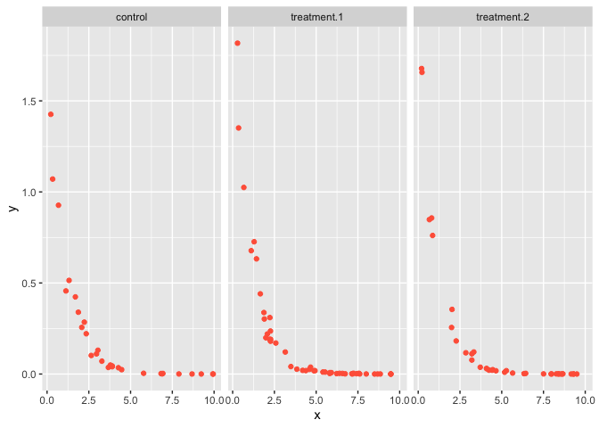
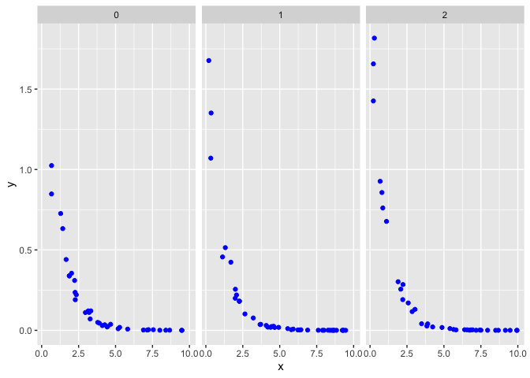
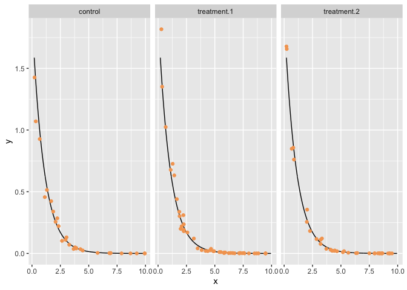
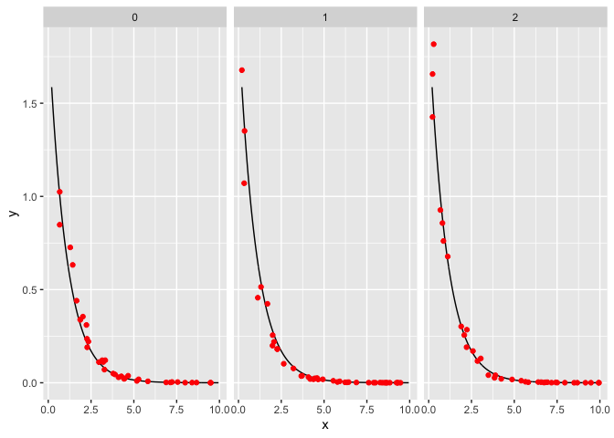
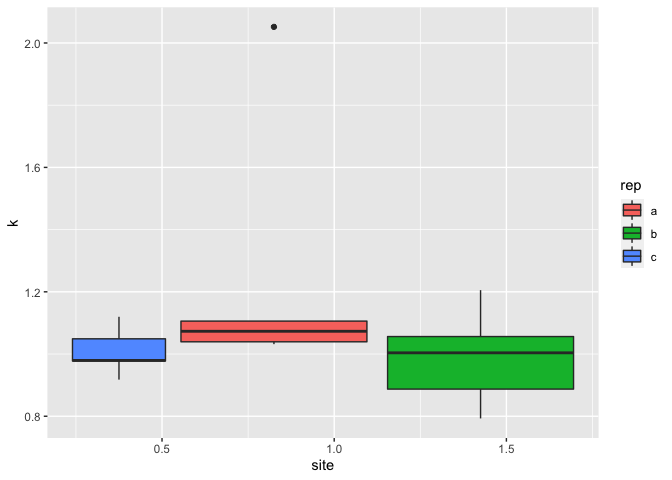

R Notebook
================

# Decay rate estimates

## Libraries

``` r
library(tidyverse)
library(ggplot2)
library(modelr)
library(nls2)
library(SciViews)
```

## Data

``` r
decay <- read.csv("/Users/aliabdulaziz/Desktop/fake_exp_decay_data.csv", header=T, na.strings="?")

summary(decay)
```

    ##        treatment  rep         site             x                y            
    ##  control    :30   a:31   Min.   :0.000   Min.   :0.2006   Min.   :0.0000779  
    ##  treatment.1:48   b:51   1st Qu.:0.000   1st Qu.:2.2476   1st Qu.:0.0016710  
    ##  treatment.2:37   c:33   Median :1.000   Median :4.4294   Median :0.0238943  
    ##                          Mean   :1.009   Mean   :4.7673   Mean   :0.2019169  
    ##                          3rd Qu.:2.000   3rd Qu.:7.2009   3rd Qu.:0.2095261  
    ##                          Max.   :2.000   Max.   :9.9467   Max.   :1.8168027

``` r
ggplot(data = decay) +
  geom_point(aes(x = x, y = y), color = "tomato1") +
  facet_wrap(~ treatment)
```



``` r
ggplot(data = decay) +
  geom_point(aes(x = x, y = y), color = "blue") +
  facet_wrap(~ site)
```



## Linearization

``` r
lin_mod <- lm(data = decay, y ~ x)
linear_intercept <- coef(lin_mod)[1]
linear_slope <- coef(lin_mod)[2]

k_guess <- exp(linear_slope)
A_guess <- exp(linear_intercept)
```

## Non-linear model

``` r
rn_model <- nls2(data = decay, y ~ A*exp(-k*x), start = list(k = k_guess, A = A_guess))

safe_fit <- function(df) {
  # Tries to fit the NLS model to the data, and returns NA if it can't for whatever reason
  fit <- tryCatch(
      nls2::nls2(formula = y ~ A * exp(-k * x),
                 data = df, 
                 start = list(A = A_guess, k = k_guess)),
      error = function(e) NA)
  fit
}
```

## Find A estimates

``` r
safely_get_A_estimate_1 <- function(nls_obj) {
  #browser()
  # CHeck whether the object is NA
  # NOte that is.na called on an nls2 object will return a vector of booleans
  if(!(is.na(nls_obj))[1]) { # So this returns TRUE if the first element of hte vector that is.na() returns is FALSE
    # Here goes the code to pull out the esimate for A
    A.estimate <- summary(nls_obj)$coefficients["A", "Estimate"]
    
  } else {
    # This gets triggered if the object is NA,
    #   Which would have happened if the model fit didn't work
    A.estimate <- NA
  }
A.estimate
}

d_errors_A <- decay %>%
  group_by(treatment, rep, site) %>%
  nest(data = c(y, x)) %>%
  mutate(fits = map(data, safe_fit),
         A = map_dbl(fits, safely_get_A_estimate_1))
```

## Find k estimates

``` r
safely_get_k_estimate <- function(nls_obj) {
  #browser()
  # CHeck whether the object is NA
  # NOte that is.na called on an nls2 object will return a vector of booleans
  if(!(is.na(nls_obj))[1]) { # So this returns TRUE if the first element of hte vector that is.na() returns is FALSE
    # Here goes the code to pull out the esimate for A
    k.estimate <- summary(nls_obj)$coefficients["k", "Estimate"]
    
  } else {
    # This gets triggered if the object is NA,
    #   Which would have happened if the model fit didn't work
    k.estimate <- NA
  }
k.estimate
}

d_errors_k <- decay %>%
  group_by(treatment, rep, site) %>%
  nest(data = c(y, x)) %>%
  mutate(fits = map(data, safe_fit),
         k = map_dbl(fits, safely_get_k_estimate))
```

## Nest data

``` r
n_nest <- decay %>%
  group_by(treatment, rep, site) %>%
  nest(data = c(y, x)) %>%
  mutate(fits = map(data, safe_fit),
         k = map_dbl(fits, safely_get_k_estimate),
         A = map_dbl(fits, safely_get_A_estimate_1))
```

## Calculate half time

``` r
half_time <- (ln(2)/n_nest$k)
print(half_time)
```

    ##  [1]        NA 0.6669271 0.6904511 0.8741347 0.8207163 0.6608148        NA
    ##  [8]        NA 0.6267915 0.6458987 0.6718220 0.7812066 0.6198867 0.5750535
    ## [15] 0.7089835 0.7552695        NA        NA        NA 0.3378306 0.7711840
    ## [22] 0.6562649 0.6799571 0.7077025 0.6190121

## Plots

## Create predictions and fit the model

``` r
unnest <- unnest(n_nest, data)
grid <- seq(from = min(unnest$x), to = max(unnest$x), length.out = 1000)
df <- data.frame(x = grid)
# Get predictions for each model
preds <- predict(rn_model, newdata = df)

preds <- df %>%
  mutate(y = preds)

ggplot() +
  geom_line(data = preds, aes(x = x, y = y), color = "black") +
  geom_point(data = unnest, aes(x =x, y = y), color = "sandybrown") +
  facet_wrap(~ treatment)
```



``` r
ggplot() +
  geom_line(data = preds, aes(x = x, y = y), color = "black") +
  geom_point(data = unnest, aes(x =x, y = y), color = "red") +
  facet_wrap(~ site)
```



### Estimated k

``` r
ggplot(data = n_nest) +
  geom_boxplot(aes(x = treatment, y = k, fill = rep))
```

    ## Warning: Removed 6 rows containing non-finite values (stat_boxplot).


``` r
ggplot(data = n_nest) +
  geom_boxplot(aes(x = site, y = k, fill = rep))
```

    ## Warning: Removed 6 rows containing non-finite values (stat_boxplot).



\`\`\`
